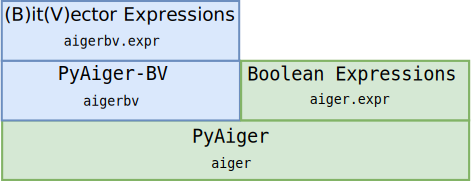

<figure>
  
  <figcaption>
      pyAiger: A python library for manipulating sequential and
      combinatorial circuits.
  </figcaption>

</figure>

[](https://travis-ci.org/mvcisback/py-aiger)
[](https://codecov.io/gh/mvcisback/py-aiger)
[](https://pyup.io/repos/github/mvcisback/py-aiger/)

[](https://pypi.python.org/pypi/py-aiger/)
[](https://pypi.python.org/pypi/py-aiger/)
[](https://zenodo.org/badge/latestdoi/130783753)

# Table of Contents
- [About](#about-py-aiger)
- [Installation](#installation)
- [Ecosystem](#ecosystem)
- [Boolean Expr DSL](#boolean-expression-dsl)
- [Sequential Circuit DSL](#sequential-circuit-dsl)
- [Scripts](#scripts)
- [Related Projects](#related-projects)
- [Citing](#citing)


# About PyAiger

1. Q: How is Py-Aiger pronounced? A: Like "pie" + "grrr".
2. Q: Why python? Aren't you worried about performance?! A: No. The goals of this library are ease of use and hackability. 
3. Q: No, I'm really concerned about performance! A: This library is not suited to implement logic solvers. For everything else, such as the creation and manipulation of circuits with many thousands of gates in between solver calls, the library is really fast enough.
4. Q: Where does the name come from? A: <a href="http://fmv.jku.at/aiger/">Aiger</a> is a popular circuit format. The format is used in <a href="http://fmv.jku.at/hwmcc17/">hardware model checking</a>, <a href="http://www.syntcomp.org/">synthesis</a>, and is supported by <a href="https://github.com/berkeley-abc/abc">ABC</a>. The name is a combination of AIG (standing for <a href="https://en.wikipedia.org/wiki/And-inverter_graph">And-Inverter-Graph</a>) and the austrian mountain <a href="https://en.wikipedia.org/wiki/Eiger">Eiger</a>.

# Ecosystem

<figure>
 
  <figcaption>Overview of the pyaiger ecosystem/stack. <a href="http://github.com/mvcisback/py-aiger-bv">pyAiger-BV</a> is an wrapper around pyAiger that supports grouping and ordering inputs, latches, and outputs. This enables working at the word (or BitVector) level.</figcaption>
</figure>

# Installation

`$ pip install py-aiger`

or as a developer:

`$ python setup.py develop`


# Boolean Expression DSL
While powerful, when writing combinatorial circuits, the Sequential
Circuit DSL can be somewhat clumsy. For this common usecase, we have
developed the Boolean Expression DSL. All circuits generated this way
have a single output.

```python
import aiger
x, y = aiger.atom('x'), aiger.atom('y')
expr1 = x & y  # circuit with inputs 'x', 'y' and 1 output computing x AND y.
expr2 = x | y  # logical or.
expr3 = x ^ y  # logical xor.
expr4 = x == y  # logical ==, xnor.
expr5 = x.implies(y)
expr6 = ~x  # logical negation.

# Atoms can be constants.
expr7 = x & aiger.atom(True)  # Equivilent to just x.
expr8 = x & aiger.atom(False)  # Equivilent to const False.

# And you can inspect the AIG if needed.
circ = x.aig

# And of course, you can get a BoolExpr from a single output aig.
expr9 = aiger.BoolExpr(circ)
```


# Sequential Circuit DSL

```python
import aiger
from aiger import utils

# Parser for ascii AIGER format.
aig1 = aiger.load(path_to_aig1_file.aag)
aig2 = aiger.load(path_to_aig2_file.aag)
```

## Sequential composition
```python
aig3 = aig1 >> aig2
```

## Parallel composition
```python
aig4 = aig1 | aig2
```

## Circuits with Latches/Feedback/Delay
```python
# Connect output y to input x with delay, initialized to True.
# (Default initialization is False.)
aig5 = aig1.feedback(
    inputs=['x'],
    outputs=['y'],
    initials=[True],
    keep_outputs=True
)
```

## Relabeling
```python
# Relabel input 'x' to 'z'.
aig1['i', {'x': 'z'}]

# Relabel output 'y' to 'w'.
aig1['o', {'y': 'w'}]

# Relabel latches 'l1' to 'l2'.
aig1['l', {'l1': 'l2'}]
```

## Evaluation
```python
# Combinatoric evaluation.
aig3(inputs={'x':True, 'y':False})

# Sequential evaluation.
sim = aig3.simulate({'x': 0, 'y': 0}, 
                    {'x': 1, 'y': 2},
                    {'x': 3, 'y': 4})

# Simulation Coroutine
sim = aig3.simulator()  # Coroutine
next(sim)  # Initialize
print(sim.send({'x': 0, 'y': 0}))
print(sim.send({'x': 1, 'y': 2}))
print(sim.send({'x': 3, 'y': 4}))


# Unroll
aig4 = aig3.unroll(steps=10, init=True)
```

## Useful circuits
```python
# Fix input x to be False.
aig4 = aiger.source({'x': False}) >> aig3

# Remove output y. 
aig4 = aig3 >> aiger.sink(['y'])

# Create duplicate w of output y.
aig4 = aig3 >> aiger.tee({'y': ['y', 'w']})

# Make an AND gate.
aiger.and_gate(['x', 'y'], out='name')

# Make an OR gate.
aiger.or_gate(['x', 'y'])  # Default output name is #or_output.

# And outputs.
aig1 >> aiger.and_gate(aig1.outputs) # Default output name is #and_output.

# Or outputs.
aig1 >> aiger.or_gate(inputs=aig1.outputs, output='my_output')

# Flip outputs.
aig1 >> aiger.bit_flipper(inputs=aig1.outputs)

# Flip inputs.
aiger.bit_flipper(inputs=aig1.inputs) >> aig1

# ITE circuit
# ['o1', 'o2'] = ['i1', 'i2'] if 'test' Else ['i3', 'i4'] 
aiger.ite('test', ['i1', 'i2'], ['i3', 'i4'], outputs=['o1', 'o2'])
```

# Scripts

Installing py-aiger should install two commandline scripts:

- aigseqcompose
- aigparcompose

These are meant to augment the
[aiger](fmv.jku.at/aiger/aiger-1.9.9.tar.gz) library. Ideally, we
would someday like feature parity.

# Related Projects

- [pyAig](https://bitbucket.org/sterin/pyaig): Another python library
  for working with AIGER circuits.

# Citing

```
@misc{marcell_vazquez_chanlatte_2018_1342134,
  author       = {Marcell Vazquez-Chanlatte},
  title        = {mvcisback/py-aiger: v1.0.0},
  month        = aug,
  year         = 2018,
  doi          = {10.5281/zenodo.1342134},
  url          = {https://doi.org/10.5281/zenodo.1342134}
}
```
